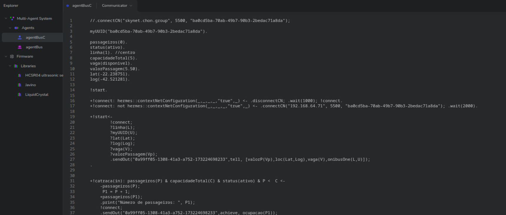
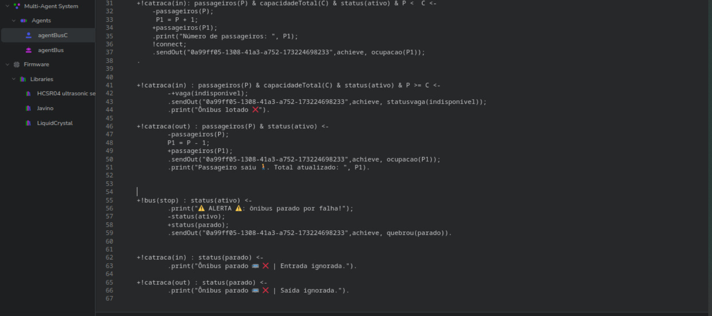
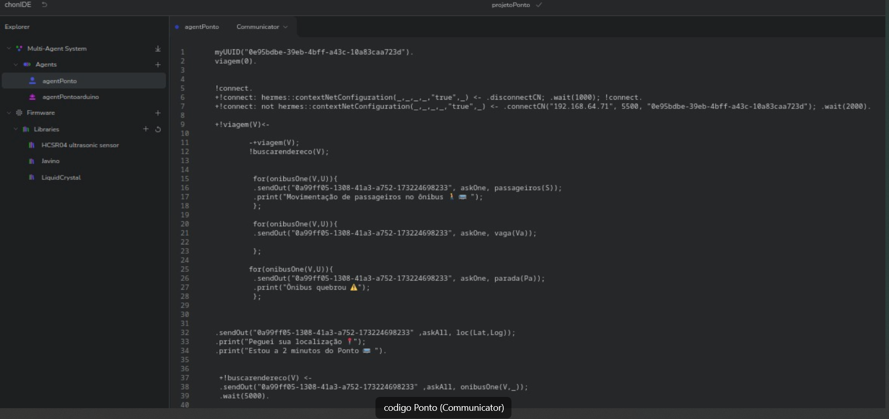
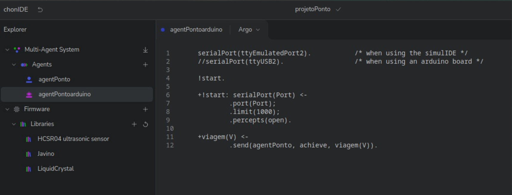
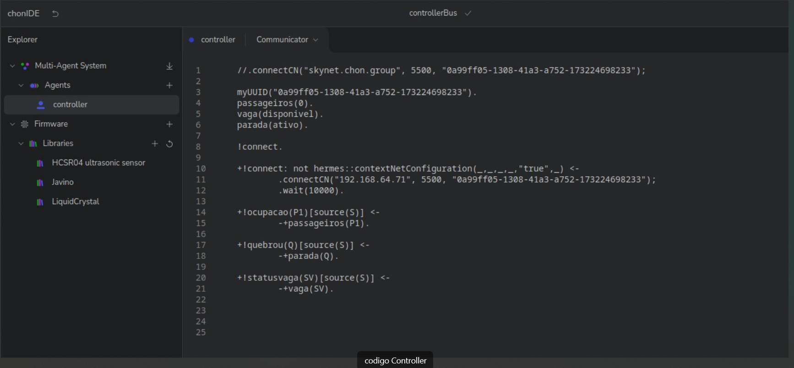
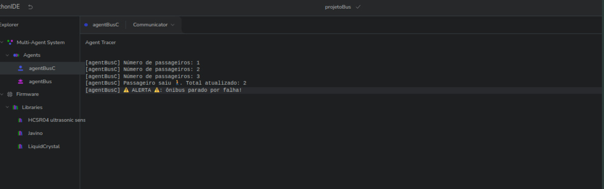
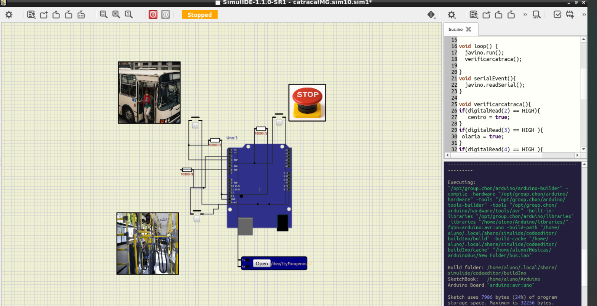
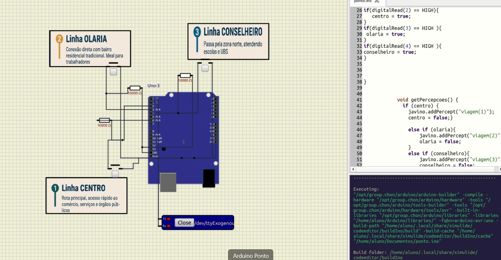

# 🚌 BusAI: Intelligent Passenger Information System

A multi-agent project based on the BDI model, developed with Jason, Javino, and Arduino, aiming to provide **dynamic and reliable information to passengers** about bus location, occupancy, and status.

---

## 🧠 Agent Architecture

The system is composed of three main agents:

### 🔵 Bus Agent

- Represents a bus in real time.
- Responsible for sending:
  - Geographic location
  - Current occupancy
  - Operating status
- Illustrative images:
  
  

---

### 🟣 Stop Agent

- Simulates the bus stop totem.
- Interacts with the passenger providing:
  - Estimated arrival time
  - Occupancy of the next vehicle
  - Failure alerts
- Illustrative images:
  
  

---

### 🟢 Coordinator Agent

- Ensures the consistency of information between bus and stop.
- Responsible for:
  - Managing data flow
- Illustrative image:
  

---

## 🔧 Technologies Used

- **Jason**: development of BDI agents (AgentSpeak(L))
- **Javino**: communication with sensors and future integration with Arduino
- **ChonIDE**: development and debugging of agents
- **Arduino**: sensor reading (e.g., stop button, distance, occupancy)

---

## 🖼️ Project Illustrations

- Bus Interactions
  

- Bus Agent Arduino
  

- Stop Agent Arduino Code
  

---

## 🎥 Video Demonstration

Watch a demonstration of the project in action in the video below:

REMOVED FOR BLIND REVIEW...

---

## ⚙️ General Operation

The system responds to the passenger as follows:

1. The passenger interacts with the totem (Stop Agent)
2. The totem requests data from the Coordinator Agent
3. The Coordinator queries the Bus Agents
4. The passenger receives information about:
   - Arrival prediction
   - Occupancy
   - Vehicle failures

---

## 👨‍💻 Authors

REMOVED FOR BLIND REVIEW

---
